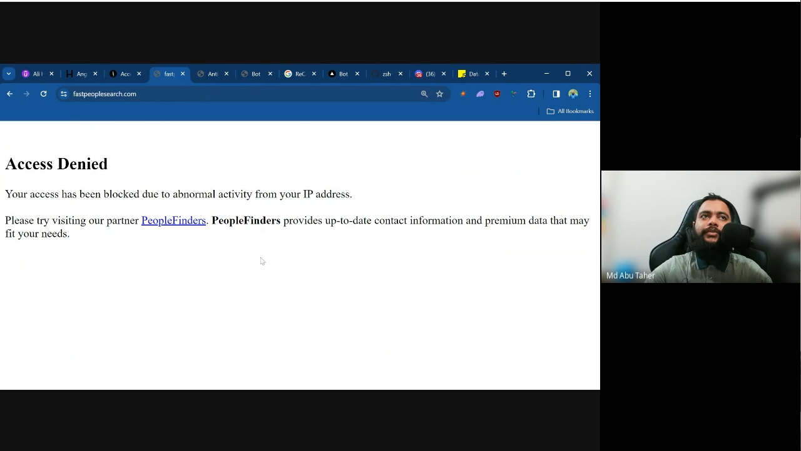
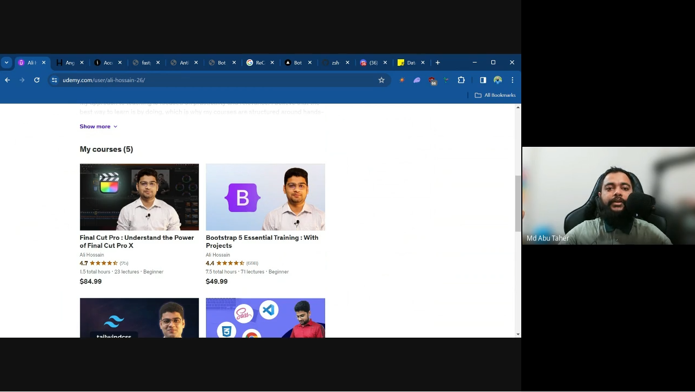
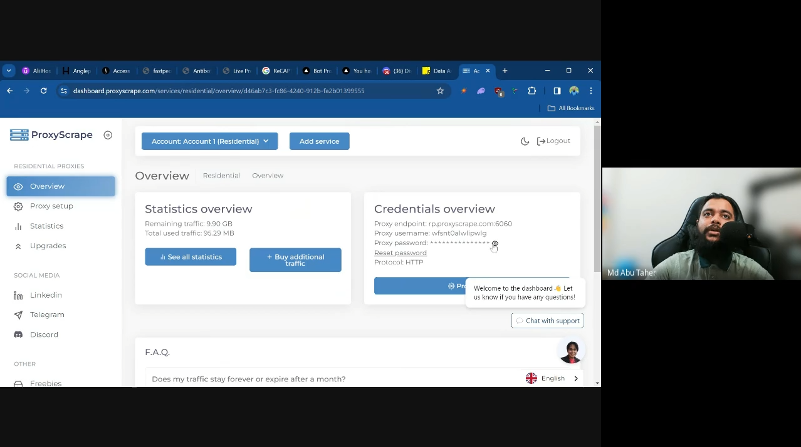
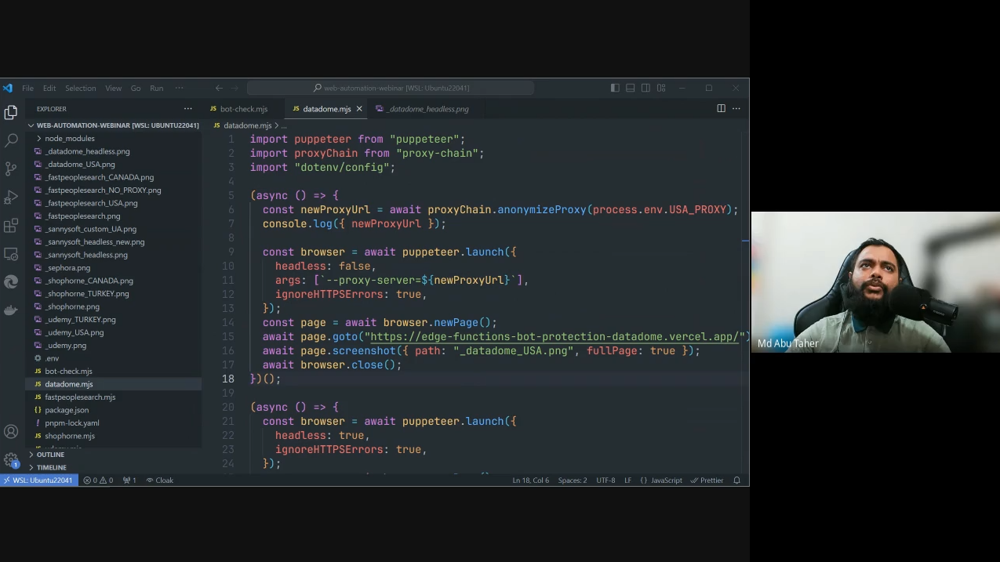
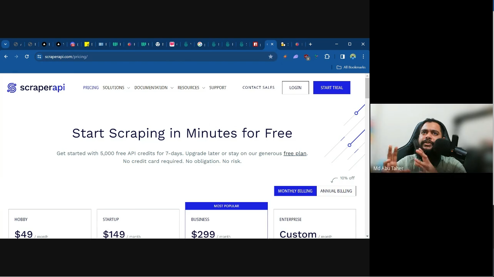

In this private webinar (in Bengali) we have discussed a few important points about proxy and bot detection.

## Blocked by IP and Location

Sephora, FastPeopleSearch and many other companies blocks traffic based on location. Sometimes we need to access such website to help the clients as part of data entry, virtual assistance and other kind of normal works.

## Different data based on location

Udemy and many other websites shows different price based on location, timezone and even user agent. It is important factor for things like customer research, competetion research and so on.

# Proxy services

There are some great proxy providers out there. We have discussed webshare and proxyscrape in this video, along with how to use the different country and session filters. Pros and Cons of free and paid proxies and so on.

## Detecting if using proxies or not

Various tools exist to detect if we are using proxies and vpns or not. Some tools checks the latencies, some have a list of blacklisted ips and so on. If we want to have the most usage, we should consider using a USA server with a USA proxies and vice versa.

## Bot protection services

Datadome is a very popular and expensive bot protection service. While it's easy to bypass their protection using normal proxies, fingerprint and so on, if they start blocking, such easy ways will not work. Same will happen to Cloudflare and any other service with strong bot protection.

## Existing tools

There are existing providers like ScraperAPI, ScrapingBee, ZenRows and many others that helps with web automation and scraping, by taking care of captcha, scaling and others by themselves. Also, There are some services like 2Captcha and Capsolver which helps solving captcha if the companies blocks us.

## Why learn about bot protection and QA

These kind of information is important to learn if we want to understand how attack on a website happens, and how to protect ourselves from such. How everything is a long cat and mouse game. Along with several legal, ethical and unethical aspects. We also discussed various ways and methods, upcoming courses and so on.